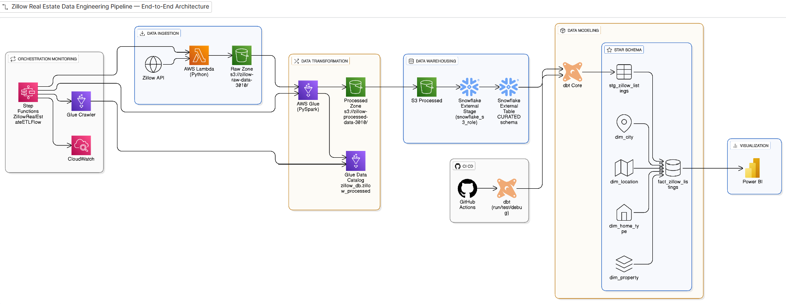

# 🏗 Zillow Real Estate Data Pipeline (End-to-End AWS ETL)

## 📘 Overview

**This project** builds an end-to-end **AWS data pipeline** that ingests Zillow data via **RapidAPI**, processes it with **Lambda** and **Glue**, loads it into **Snowflake**, and automates testing and deployment using **dbt** and **GitHub Actions (CI/CD)**.

---

  

---

## 🧱 Architecture Overview

| Layer | Tool | Purpose |
|-------|------|----------|
| Ingestion | AWS Lambda + Python | Fetch data from Zillow API and store in S3 |
| Transformation | AWS Glue + PySpark | Clean and convert JSON → Parquet |
| Orchestration | AWS Step Functions | Manage full ETL workflow |
| Warehousing | AWS Snowflake | Store analytical data |
| Modeling | dbt | Create dimensions, facts, and KPIs |
| Visualization | Power BI | Build dashboards |
| Monitoring | CloudWatch | Track ETL runs and errors |
| CI/CD | GitHub Actions | Automate dbt build, testing, and validation in Snowflake |

---

## ⚙️ Tech Stack
**Languages:** Python, SQL  
**AWS Services:** S3, Lambda, Glue, Step Functions, Snowflake, CloudWatch, IAM  
**Others:** dbt, Power BI, GitHub Actions  

---

## 🧩 Data Flow
1. **Lambda (Ingestion)** → Calls Zillow API and dumps JSON to `s3://zillow-raw-data-3010/`
2. **Glue (Transformation)** → Reads raw JSON → Flattens nested structure → Cleans → Writes Parquet to `s3://zillow-processed-data-3010/`
3. **Step Functions (Orchestration)** → Orchestrates the AWS workflow (Lambda → Glue → data ready for Snowflake)
4. **dbt + Snowflake (Modeling)** → Loads processed data from S3 into Snowflake and builds analytics models
5. **Power BI (Visualization)** → *(Planned)* to visualize housing trends and KPIs using curated Snowflake data
6. **GitHub Actions (CI/CD)** → Automates dbt testing and deployment, ensuring data quality and consistency on every code change

---

## 📸 Results

| AWS Glue Job Success | CloudWatch Logs |
|----------------------|-----------------|
|  |  |

| AWS Glue Job Success | Step Function Success |
|----------------------|-----------------|
|  |  |

| Snowflake Curated View | dbt test Success |
|-------------------------|-----------------|
|  |  |

| dbt Lineage grahp |
|-------------------------|
|  |

**Additional Artifacts:**
- `s3://zillow-raw-data-3010/` → Raw JSON dumps  
- `s3://zillow-processed-data-3010/` → Cleaned, partitioned Parquet files (`city`, `status`, `ingestion_date`)  
- `snowflake_curated_view.png`: Shows final `STG_ZILLOW_LISTINGS` view in Snowflake with dims and fact tables.
- `dbt_test_results.png`: Documented realistic dbt test failures to showcase data quality checks.

---

## 🧠 Learning Outcomes
- Integrate APIs into AWS data pipelines  
- Build automated ETL + orchestration flows  
- Model data in Snowflake with dbt  
- Automate & monitor pipelines professionally