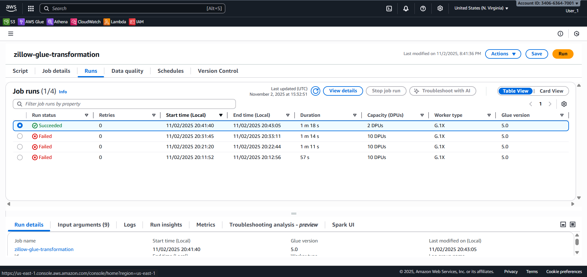
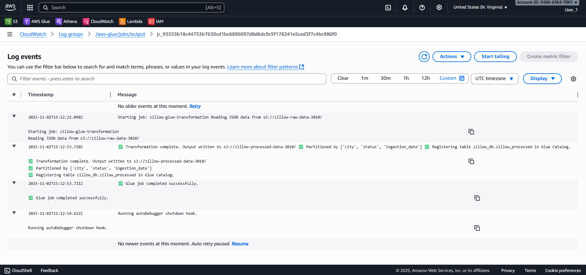
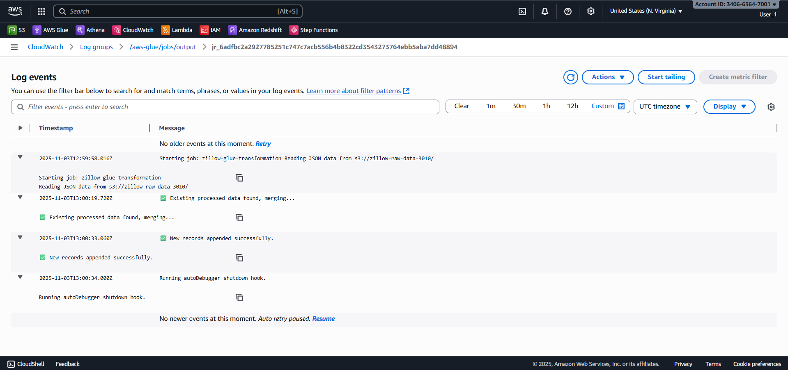
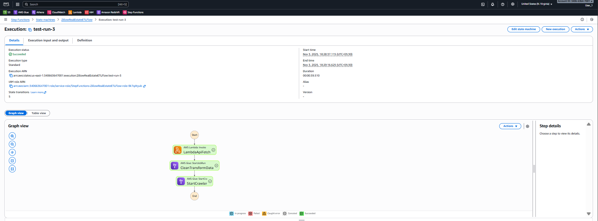
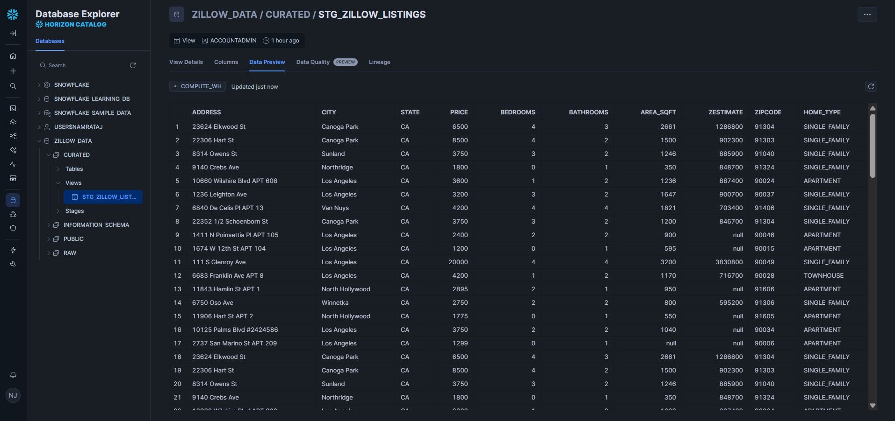
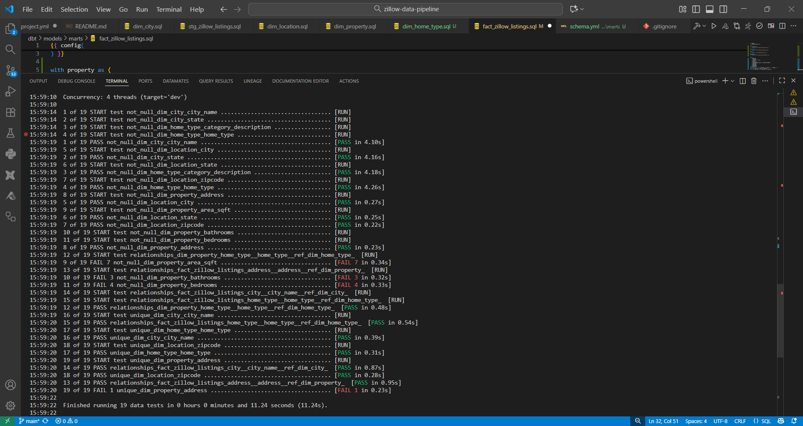
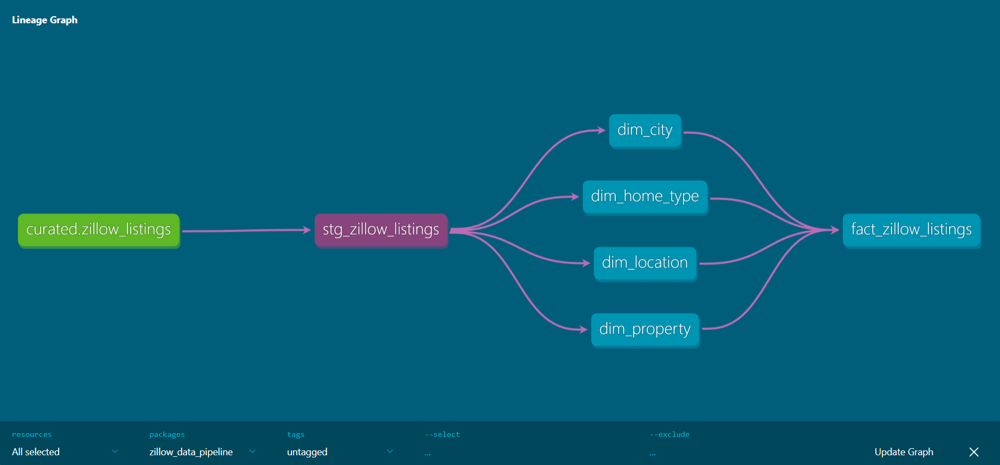

# 🏗 Zillow Real Estate Data Pipeline (End-to-End AWS ETL)

## 📘 Overview
This project builds a production-grade **data engineering pipeline** that ingests property listings from the **Zillow API** (via RapidAPI), processes them in **AWS**, and loads the curated dataset into **Snowflake** for analytics and **Power BI visualization**.

---

## 🔧 Architecture Used

| Layer | Tool | Purpose |
|-------|------|----------|
| Ingestion | AWS Lambda + Python | Fetch data from Zillow API and store in S3 |
| Transformation | AWS Glue + PySpark | Clean and convert JSON → Parquet |
| Orchestration | AWS Step Functions | Manage full ETL workflow |
| Warehousing | AWS Snowflake | Store analytical data |
| Modeling | dbt | Create dimensions, facts, and KPIs |
| Visualization | Power BI | Build dashboards |
| Monitoring | CloudWatch | Track ETL runs and errors |
| CI/CD | GitHub Actions | Automate Lambda + dbt deployment |

---

## ⚙️ Tech Stack
**Languages:** Python, SQL  
**AWS Services:** S3, Lambda, Glue, Step Functions, Snowflake, CloudWatch, IAM  
**Others:** dbt, Power BI, GitHub Actions  

---

## 🧩 Data Flow
1. **Lambda (Ingestion)** → Calls Zillow API and dumps JSON to `s3://zillow-raw-data-3010/`
2. **Glue (Transformation)** → Reads raw JSON → Flattens nested structure → Cleans → Writes Parquet to `s3://zillow-processed-data-3010/`
3. **Step Functions (Orchestration)** → Triggers end-to-end ETL (Lambda → Glue → Snowflake load)
4. **Snowflake + dbt (Modeling)** → Creates analytic models
5. **Power BI (Visualization)** → Visualizes housing trends & pricing metrics

---

## 🚀 Project Progress Tracker  

**Day 1:** Setup + Documentation ✅ *(Completed on Oct 30, 2025)*  
**Day 2:** API Ingestion Lambda ✅ *(Completed on Oct 30, 2025)*  
**Day 3:** Glue Transformation ✅ *(Completed on Nov 02, 2025)*  
**Day 4:** Step Functions Orchestration ✅ *(Completed on Nov 03, 2025)*  
**Day 5:** Snowflake + dbt ✅ *(Completed Nov 5-6, 2025)*
**Day 6:** Power BI Dashboard ⏳ *Upcoming*  
**Day 7:** CI/CD + Monitoring ✅ *(Completed on Nov 06, 2025)*  

---

## 📸 Results

| AWS Glue Job Success | CloudWatch Logs |
|----------------------|-----------------|
|  |  |

| AWS Glue Job Success | Step Function Success |
|----------------------|-----------------|
|  |  |

| Snowflake Curated View | dbt test Success |
|-------------------------|-----------------|
|  |  |

| dbt Lineage grahp |
|-------------------------|
|  |

**Additional Artifacts:**
- `s3://zillow-raw-data-3010/` → Raw JSON dumps  
- `s3://zillow-processed-data-3010/` → Cleaned, partitioned Parquet files (`city`, `status`, `ingestion_date`)  
- `snowflake_curated_view.png`: Shows final `STG_ZILLOW_LISTINGS` view in Snowflake with dims and fact tables.
- `dbt_test_results.png`: Documented realistic dbt test failures to showcase data quality checks.

---

## 📸 Results (To Add Later)
- Power BI dashboard  

---

## 🧠 Learning Outcomes
- Integrate APIs into AWS data pipelines  
- Build automated ETL + orchestration flows  
- Model data in Snowflake with dbt  
- Automate & monitor pipelines professionally

---

## 🗂 Folder Structure (Local)
```bash
zillow-data-pipeline/
│
├── .github/workflows/deploy.yml
├── dbt/
│   ├── profiles.yml
│   └── models/
│       ├── staging/
│       └── marts/
├── infra/
│   ├── iam_policies.json
│   ├── Snowflake_schema.sql
│   └── s3_buckets_setup.txt
├── screenshots/
│   ├── glue_job_success.png
│   └── cloudwatch_log_output.png
├── src/
│   ├── ingestion/
│   │   ├── sample_response.json
│   │   ├── test_zillow_api.py
│   │   └── zillow_api_ingest.py
│   ├── orchestration/
│   │   └── step_function_definition.json
│   └── transformation/
│       └── glue_zillow_transform.py
└── README.md